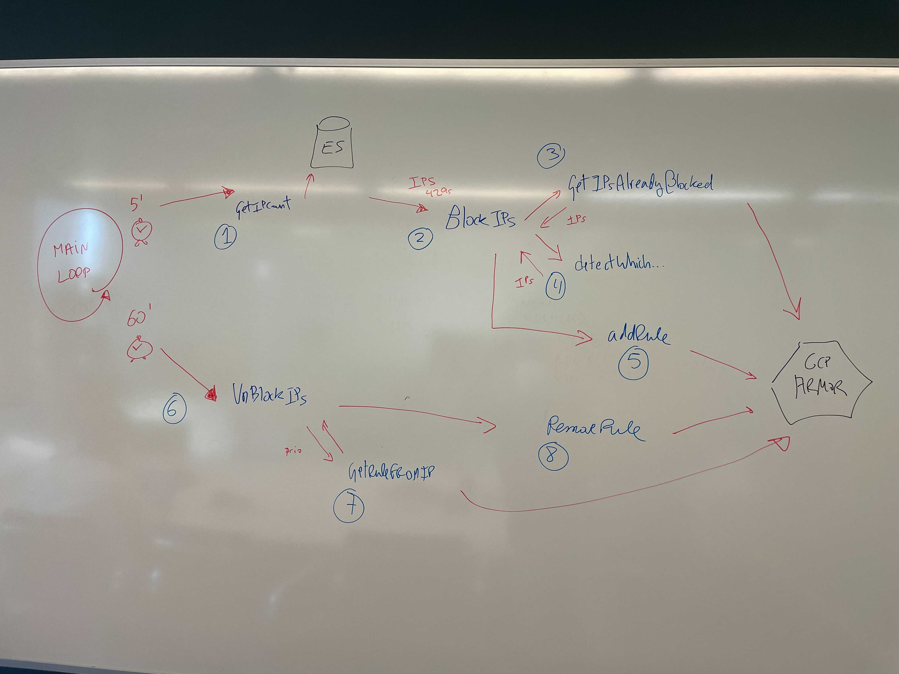

# ip-blocker
Daemon running in k8s that can block ideally IPs reading from a datasource where the IPs are already marked as banned and writing to a cloud firewall


[](https://goreportcard.com/report/softonic/ip-blocker)
[](https://github.com/softonic/ip-blocker/releases)
[](https://github.com/softonic/ip-blocker/blob/master/LICENSE)
[](https://hub.docker.com/r/softonic/ip-blocker)


# Quick Start

## Deployment

### Requirements

In this example we assume you already have a k8s cluster running

### Deploy using kubectl 

Generate secrets. Credentials to connect to ES

In order to create these secrets

```
...
        - name: ELASTIC_USERNAME
          valueFrom:
            secretKeyRef:
              name: elastic-credentials
              key: username
        - name: ELASTIC_PASSWORD
          valueFrom:
            secretKeyRef:
              name: elastic-credentials
              key: password

...
        - name: GOOGLE_APPLICATION_CREDENTIALS
          value: /secrets/credentials.json
        volumeMounts:
        - name: credentials
          mountPath: /secrets
      volumes:
      - name: credentials
        secret:
          secretName: google-credentials
...
```


```bash
$ make deploy
```

You can find public image in the softonic/ip-blocker docker hub repository.

### Deploy using Helm

Generate secrets like kubectl install example.

```bash
$ make helm-deploy
```


# DEVEL ENVIRONMENT

Compile the code and deploy the needed resources

```bash
$ skaffold dev
```


# Motivation

We want to block the IPs that are crawling our site and are potentially jeopardizing our infrastructure, for 1 hour.
We realize that some unwanted crawlings are not behaving and are gettint our site slower and sometimes unresponsive.

In this first version the daemon is reading from an ElasticSearch and getting the lasts requests that returned 429 to the client.
Once we got these IPs that are being throttle, we block the IPs in the GCP firewall called Armor.

Final goal would be to someone to use this tool and be able to use other source of data other than ES and other actor different than GCP Armor.


# Diagram





    A[Start Golang Daemon] --> B(Initialize App, ElasticSource, and GCPArmorActor)
    B --> C(Start App)
    C -->|Run Goroutines| D1(Fetch IPs from Elasticsearch)
    C -->|Run Goroutines| D2(Manage Blocked IPs)
    D1 --> E1(Interact with GCPArmorActor)
    E1 --> E2(Block IPs using Google Cloud Armor)
    D2 --> F1(Interact with GCPArmorActor)
    F1 --> F2(Unblock IPs using Google Cloud Armor)
    C --> G(Listen for Interrupt Signal)
    G --> H[Stop Golang Daemon]

